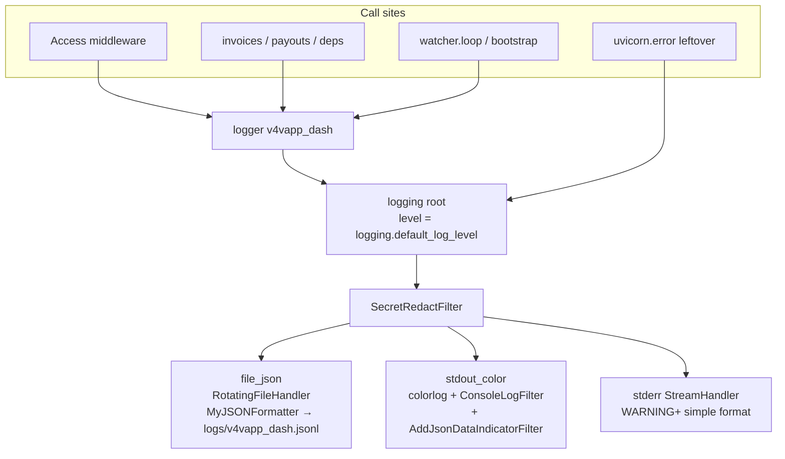
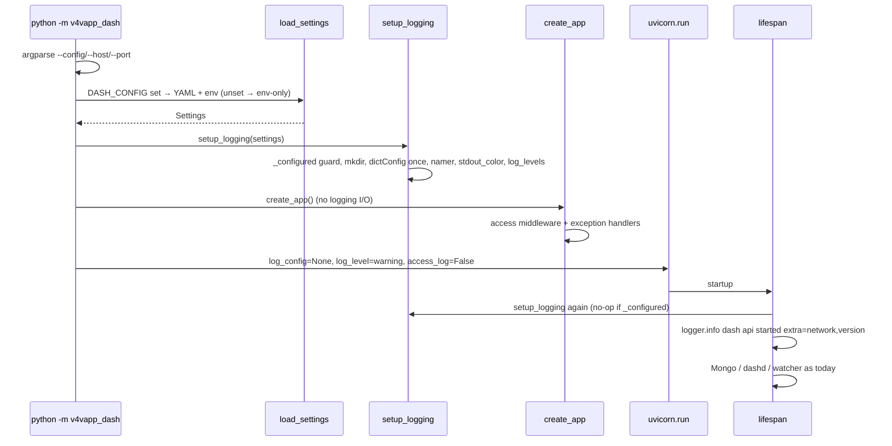
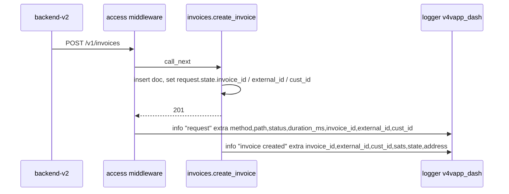

# v4vapp-dash JSON Logging + YAML Config

| Field | Value |
|---|---|
| **Author** | _TBD_ |
| **Date** | 2026-08-14 |
| **Status** | Ready for implementation |
| **Type** | Side project — independently shippable from invoice / watcher work |
| **Repo** | `v4vapp-dash` |
| **Workspace** | `/Users/bol/Documents/dev/v4vapp/v4vapp-dash` |
| **Reference** | `v4vapp-backend-v2` logging (do **not** import that package) |

This document supersedes the **structured-logs half** of PR 9 in [`docs/design-dash-integration-bridge.md`](design-dash-integration-bridge.md) (Observability §). **D9** explicitly drops that section’s “JSON logs to stdout” in favour of backend-v2’s color stdout + `logs/*.jsonl`. Prometheus metrics, secret-scan CI (already shipped), and `/metrics` stay in the product design. This side project is logging + config only.

---

## Overview

`v4vapp-dash` is a small FastAPI service whose settings today live in a flat pydantic-settings `Settings` class loaded from `.env` (`src/v4vapp_dash/config.py`). Logging is the stdlib default: two modules (`dashd/bootstrap.py`, `watcher/loop.py`) call `logging.getLogger("v4vapp_dash")` with no formatter, no JSON file, no request context, and no Uvicorn intercept. Docker starts the process as `uvicorn v4vapp_dash.main:app`, so Uvicorn’s own `INFO:` access lines (including the 30 s `/health` probe) will dominate `docker compose logs` the same way they did on `api-v2` before that entrypoint passed `log_config=None`.

This side project copies a **slim subset** of the backend logging stack (`MyJSONFormatter`, rotation namer, `setup_logging()`, colored console) into `src/v4vapp_dash/logging/` and folds the current `.env` knobs into an optional YAML config in the same family as `v4vapp-backend-v2` (`--config` / `DASH_CONFIG` when the operator has a local file). Secrets stay out of git: YAML holds structure and `_env_var` pointers; real keys stay in the environment or a secret file. **`config/sample.config.yaml` is created locally and gitignored in this series — not committed.** The schema contract in git is `tests/data/config/sample.config.yaml`. Docker boots env-only unless the operator mounts a YAML and sets `DASH_CONFIG`. Uvicorn is started programmatically like `src/api_v2.py` (`log_config=None`, `access_log=False`) so Uvicorn’s own `INFO:` lines disappear. JSON is written to `logs/v4vapp_dash.jsonl`; **stdout stays color text** (D9). A request middleware adds `method`, `path`, `status`, `invoice_id`, `external_id`, `cust_id`, `duration_ms` — INFO only for mutating routes and errors; poller GETs are DEBUG.

**Complexity: M (medium), 20–28 hours** across three PRs. The hard parts are Uvicorn intercept (CLI vs `uvicorn.run`) and a **custom** YAML settings source (flatten + `_env_var` + plaintext-secret reject) on top of the existing `Settings` + test cache. QueueListener + FastAPI loop is **avoided** — that is the backend’s most expensive logging bug class, and it only exists to keep Telegram I/O off the caller thread.

---

## Background & Motivation

### Current dash state

| Surface | Today |
|---|---|
| Settings | `Settings(BaseSettings)` in `src/v4vapp_dash/config.py`, `env_file=".env"`, `extra="ignore"`. `@lru_cache` `get_settings()`. |
| Knobs | `example.env` — ~30 keys: `DASH_*`, `MONGO_*`, quote URLs, CMC key. |
| Entry | `src/v4vapp_dash/main.py` defines `app = create_app()` at import. Dockerfile `CMD` is `uvicorn v4vapp_dash.main:app --host 0.0.0.0 --port 8080`. |
| Logging | No `dictConfig`. No `logs/`. `bootstrap.py` and `watcher/loop.py` use the default `StreamHandler` if the root logger is touched; invoice/quote/auth/RPC paths log nothing. |
| Secrets | `.gitignore` covers `.env`, `secrets/*`, `*.xprv`, `*.xpub`. CI already greps for live `DASH_MNEMONIC=`, `DASH_XPRV=`, `DASH_XPUB=xpub…`. |
| Observability intent | Product design already specified JSON fields `ts, level, event, invoice_id, external_id, address, state, duffs, txid, err` and “never log mnemonic / xprv / API key”. Not implemented. |

Pain:

1. `docker compose logs` will be unusable once the healthcheck and backend poller are live — Uvicorn access lines every 30 s, no invoice id on failures.
2. Watcher errors (`listunspent failed`, stuck invoices, late payments) are free-text with no `invoice_id` / `external_id` / `cust_id`.
3. Operators who already run backend-v2 expect `--config foo.config.yaml`, `logs/*.jsonl`, and `rotation/` — dash currently has a different ritual (`.env` only).
4. Folding structure into YAML now is cheaper than after a second service clone. `example.env` already mixes structure (poll interval, settle policy) with secrets (API key, RPC password, xpub).

### Backend logging (source of truth)

Full reference: `/Users/bol/Documents/dev/v4vapp/v4vapp-backend-v2/docs/logging_system.md` (architecture, filters, queue stall). **Chosen Uvicorn flags come from `api_v2.py`, not from `logging_system.md` §12** — that section’s service table still says api-v2 does not set `log_level` / `access_log`, which is stale relative to the file.

What `api-v2` actually does (this is the pattern dash should match):

```707:715:/Users/bol/Documents/dev/v4vapp/v4vapp-backend-v2/src/api_v2.py
    uvicorn.run(
        app,
        host=args.host,
        port=args.port,
        workers=args.workers,
        log_config=None,
        log_level="warning",
        access_log=False,
    )
```

- `InternalConfig(config_filename=args.config)` **before** `uvicorn.run`.
- `log_config=None` — Uvicorn does **not** reset handlers; our `dictConfig` stays in charge.
- `log_level="warning"` + `access_log=False` — no `INFO: 127.0.0.1 - "GET /health"` spam from the healthcheck.
- Lifespan start log: `logger.info(..., extra={"notification": False})`.
- Compose: `command: ["python", "src/api_v2.py", "--config", "${DOCKER_COMPOSE_CONFIG:-devdocker.config.yaml}"]` and volume `./logs_docker:/app/logs`.

The production dictConfig (`config/logging/5-queued-stderr-json-file.json`) is a `QueueHandler` that fans out to `file_json` + Telegram `CustomNotificationHandler`. The queue exists so Telegram HTTP does not block the caller. Its event-loop handoff (`notification_loop` reassigned in every `main_async_start`) is documented as a footgun that can stall **all** file writes for up to 40 s. Dash has no Telegram bot. Copying the queue is not justified.

Dash’s committed dictConfig **adapts the `2-stderr-json-file.json` layout** (no queue, no notification, `disable_existing_loggers: false`, JSON formatter + stderr WARNING) and **takes rotation numbers from production `5-queued-stderr-json-file.json`** (`maxBytes` 2_000_000, `backupCount` 10, file level DEBUG). It is not a verbatim copy of either file. Backend then **adds** a `stdout_color` handler in `setup_logging()` (colorlog, `ConsoleLogFilter`). Dash should do the same.

### What we will not copy

| Backend piece | Why not |
|---|---|
| `InternalConfig` singleton | Redis, Mongo clients, Hive, LND, version gate, `error_code_manager`. Dash already has `get_settings()` + lifespan-owned `Mongo`/`Dashd`. |
| `CustomNotificationHandler`, `NotificationProtocol`, Telegram bots | Out of scope. Product design says “wire into the existing notification bot later”. |
| `ErrorTrackingFilter`, `ErrorCode`, `ErrorCodeManager` Mongo persistence | Dedup of recurring errors is useful at Hive-monitor scale. Dash can log ERROR and let operators grep `invoice_id`. Revisit if late-payment spam appears. |
| `NotificationFilter`, `AddNotificationBellFilter` | No notification handler. |
| `5-queued-stderr-json-file.json` QueueListener | No Telegram I/O to hide. Avoids the detached-loop stall. |
| Importing `v4vapp_backend_v2` | Separate repo. Copy a slim subset and delete unused filters. |
| Backend YAML-with-plaintext-secrets | `devdocker.config.yaml` embeds Hive WIF keys, CMC keys, bot tokens. Product design already forbids copying that anti-pattern for xpub / mnemonic / API keys. |

---

## Goals & Non-Goals

### Goals

- JSON lines to `logs/v4vapp_dash.jsonl` with `RotatingFileHandler` (2 MB × 10) and the backend rotation namer (`foo.001.jsonl`, optional `logs/rotation/`).
- Colored console for local / `docker compose logs` (colorlog, fallback to plain). **Stdout is not JSON** (D9).
- Uvicorn’s own handlers silenced the way `api_v2.py` does (`log_config=None`, `access_log=False`). Our middleware replaces access lines only where they are useful (not on the backend poller GET).
- Request-scoped extras: `method`, `path`, `status`, `invoice_id`, `external_id`, `cust_id`, `duration_ms`. Watcher extras: `state`, `address`, `txid`, `duffs_received` (path/index at DEBUG).
- **Never** emit mnemonic, xprv, WIF, `DASH_API_KEY`, RPC password, `mongo_uri` credentials, or raw xpub. Defense in depth: `SecretRedactFilter` (msg + args + known Settings values).
- Optional YAML config in backend style (`--config` / `DASH_CONFIG`) that **folds** today’s `.env` structure. Env still overrides. Docker default is env-only (no committed sample in the image). Docker-friendly.
- Reuse by **copying** `MyJSONFormatter`, `_json_default`, `parse_log_level`, `make_rotation_namer`, and a tiny `setup_logging()` into `src/v4vapp_dash/logging/`.
- Independently shippable: no invoice schema change, no watcher algorithm change, no Prometheus in this series.

### Non-goals

- Telegram / notification bot, `error_code` Mongo tracking, `InternalConfig`.
- Prometheus `/metrics` expansion (still the product design’s later PR).
- Importing `v4vapp_backend_v2` as a dependency.
- Changing the Mongo document model or dashd RPC.
- Committing secrets in YAML (even gitignored YAML should use `_env_var`).
- Multi-worker Uvicorn (`workers>1` would need QueueHandler + per-worker files; dash stays 1 worker like api-v2 default).
- Replacing CI secret-scan (already present in `.github/workflows/ci.yml`).

---

## Key Decisions

### D1 — Copy a slim `mylogger` + `setup_logging`; do not import the backend package

**Decision.** New package `src/v4vapp_dash/logging/`. Copy and trim. Logger name stays `v4vapp_dash` (already used).

**Rationale.** Separate repo; product design forbids importing `v4vapp_backend_v2`. The reusable core is ~250 lines after deleting notification / error-code branches. `MyJSONFormatter.format()` currently consults `InternalConfig().error_codes` when `record.error_code` is set — that branch is deleted. `_json_default` keeps `Decimal` + lazy `bson.Decimal128` because dash already depends on `pymongo` and quotes use `Decimal`.

### D2 — No QueueHandler / QueueListener in v1 of this side project

**Decision.** Ship the `2-stderr-json-file.json` shape: root handlers are `file_json` (DEBUG/INFO) + we attach `stdout_color` in code. No `queue_handler`, no `notification` handler.

**Rationale.** Expected load is tiny: compose healthcheck every 30 s, backend invoice poll on the order of 1/s at most, watcher tick every 10 s (`DASH_POLL_INTERVAL_S`). A JSON line is ~0.5–2 KB. `RotatingFileHandler.emit` is sub-millisecond local I/O. The backend queue exists to hide Telegram HTTP (10 s connect + 30 s read). Copying it without a bot still requires `atexit` listener stop and creates the exact `notification_loop` class of bug if anyone later adds a handler that awaits. Revisit only if we add a blocking handler.

### D3 — Silence Uvicorn’s own handlers; emit a *selective* access log

**Decision.** Programmatic `uvicorn.run(..., log_config=None, log_level="warning", access_log=False)` from `python -m v4vapp_dash`, matching `api_v2.py` (not the stale §12 table). A FastAPI middleware writes a `request` line:

| Path / outcome | Level |
|---|---|
| `/health`, `/` | DEBUG |
| `GET /v1/invoices/{invoice_id}`, `GET /v1/invoices/by-external/{external_id}` | DEBUG on 2xx; INFO on 4xx/5xx |
| POST create / cancel, `/metrics`, other routes | INFO |
| Any 4xx/5xx (including unhandled 500) | INFO or ERROR (see middleware) |

YAML `log_levels` still sets `uvicorn`, `uvicorn.error`, `uvicorn.access` to WARNING as a belt.

**Rationale.** `log_levels.uvicorn: WARNING` is overwritten when Uvicorn applies its own `dictConfig` — that part of `logging_system.md` §12 is still true. Current flags are in `api_v2.py` 707–715. Copying `access_log=False` and then emitting INFO on **every** GET would recreate the same spam on the backend poller (`GET /v1/invoices/{id}` ~1/s). Dash is a private API; domain events (create/cancel/settle) already carry `invoice_id`. Access lines exist so 401/404/500 and mutating calls are greppable.

**Reload path is CLI uvicorn only.** `python -m v4vapp_dash` has no `--reload`; `uvicorn.run(create_app(), …)` cannot reload (needs an import string). Local: `uv run uvicorn v4vapp_dash.main:app --reload --port 8088` (env-only), or after creating the local file `DASH_CONFIG=config/sample.config.yaml uv run uvicorn v4vapp_dash.main:app --reload --port 8088`. In that mode Uvicorn’s own formatter may still print; `setup_logging` runs from **lifespan**, not from `create_app()` / import.

### D4 — YAML for structure; env / secret file for keys; env always wins

**Decision.**

| File | Git | Role |
|---|---|---|
| `tests/data/config/sample.config.yaml` | **committed** | Schema contract for CI/tests. No secrets. `xpub_file: ""`. Copy this to create the local operator file. |
| `config/sample.config.yaml` | **gitignored / not committed in this series** | Operator/dev contract on disk: complete schema, non-secret defaults, `_env_var` names. Create with `cp tests/data/config/sample.config.yaml config/sample.config.yaml`. |
| `config/prod.config.yaml` | **not in this series** | Do not add. |
| `config/logging/2-stderr-json-file.json` | committed | dictConfig. Formatter `()` points at `v4vapp_dash.logging.mylogger.MyJSONFormatter`. |
| `config/dev.config.yaml` | **gitignored** | Operator machine overrides (paths, `docs_enabled`, network). Still no plaintext secrets. |
| `.env` / Compose `environment:` / Docker secrets | not committed | Real `DASH_API_KEY`, `DASH_RPC_PASSWORD`, `MONGO_URI`, `DASH_XPUB` / xpub file. |
| `example.env` | committed | Shrinks to **secrets-only** placeholders + how to create `config/sample.config.yaml` from the test fixture. |

Precedence (highest wins): process env (including Compose `environment:`) → `.env` → YAML → field defaults. This is pydantic-settings’ normal order plus one **custom** YAML source (`DashYamlSettingsSource`, **not** stock `YamlConfigSettingsSource`) below dotenv.

`DASH_CONFIG` is a three-way switch (never “auto-load sample because the file exists”):

| Value | Behavior |
|---|---|
| **unset** | No YAML. Today’s env-only `Settings`. Tests and `uvicorn` without a flag stay isolated. |
| empty / `none` / `-` | No YAML. Same as unset; tests use this explicitly. |
| any other string | Resolve the file (`config/` prefix if not absolute). **Fail loudly** (`FileNotFoundError` / boot exit) if missing. |

`--config` / `DASH_CONFIG` is what turns YAML on. **Default boot is env-only** (`DASH_CONFIG` unset; `__main__` `--config` default is `os.getenv("DASH_CONFIG")`, not a hard-coded `sample.config.yaml`). The image does not contain `config/sample.config.yaml`. Compose may set `DASH_CONFIG` **only if** the host file exists and is bind-mounted (e.g. `./config/sample.config.yaml:/app/config/sample.config.yaml:ro`). Prefer documenting that optional mount rather than making YAML required to start the container.

**Rationale.** User asked to fold `.env` into YAML **and** stay Docker-friendly, then chose **not** to commit `config/sample.config.yaml` at this stage. A missing file in the image must not `FileNotFoundError` at boot. Backend’s `_env_var` pattern (`ExchangeNetworkConfig.api_key_env_var` in `setup.py`) is the correct prior art — not the Hive-key-in-YAML anti-pattern the product design already called out. Compose today sets `DASH_BIND` / `DASH_PORT` / regtest RPC in `environment:`; that must keep working without editing YAML inside the image. Stock pydantic-settings `YamlConfigSettingsSource` cannot flatten nested keys, resolve `_env_var`, or reject plaintext secrets — we write our own.

`config/sample.config.yaml` and `config/dev.config.yaml` are both gitignored so a pasted password (or an unfinished sample) cannot land on GitHub by accident. The committed fixture is the schema contract.

### D5 — Keep `Settings` flat; YAML is a nested façade

**Decision.** Do **not** nest `Settings` into `settings.server.port` this series. Keep `dash_port`, `mongo_uri`, `dash_rpc_password`, … so `get_settings()`, `conftest.py` monkeypatches, and every `settings.dash_*` call stay valid. A small mapping flattens YAML sections onto those fields. Nested Pydantic models are a later cleanup if the settings surface grows.

**Rationale.** Callers of `get_settings()` today: `main.py`, `deps.py`, `health.py`, `invoices.py`, `quotes/service.py`, `limits/hive_config.py`, plus tests. `keys.py` takes a `Settings` argument; `watcher/loop.py` receives `settings` from lifespan. Renaming fields is unrelated churn. The user-facing YAML can still be nested and readable. `LoggingSettings` is the one nested model (new); it is passed through as a dict, not flattened. `env_nested_delimiter="__"` so Compose can set `LOGGING__CONSOLE_LOG_LEVEL=WARNING`.

### D6 — No `InternalConfig` singleton

**Decision.** `get_settings()` remains the only cached config object. `setup_logging(settings)` is a function. `logger = logging.getLogger("v4vapp_dash")` is imported from `v4vapp_dash.logging`.

**Rationale.** Dash lifespan already owns Mongo and Dashd on `app.state`. A second singleton that also wants an event loop is how the backend notification stall happened.

### D7 — Redact in the logging pipeline, not only by convention

**Decision.** `SecretRedactFilter` on every handler. Primary control remains **never pass secrets in `extra=`**. The filter is defense in depth:

1. **Known values** from current `Settings` (if `get_settings` is already loaded): `dash_api_key`, `dash_api_key_prev`, `dash_rpc_password`, `mongo_uri`, `dash_xpub`, `coinmarketcap_api_key`, and any mnemonic-file contents if payouts ever load one. Replace each occurrence with `***`.
2. **Extra keys** whose names match `(?i)(password|secret|token|api_key|authorization|mnemonic|xprv|xpub|seed|wif|mongo_uri|rpc_password)`.
3. **Shapes** in `record.msg`, each element of `record.args` (so `%s` interpolation cannot smuggle values), and extra **values**: `xprv`/`xpub`/`tpub`/`ypub`/`zpub` payloads, WIF-shaped strings (`[5KL][1-9A-HJ-NP-Za-km-z]{50,}`), `mongodb://user:pass@…`.
4. Replace **only the matching token**, not the whole message — `WalletStateMismatch` text that already embeds `_brief(account_xpub)` (`tpubDC5FSnBi…`) must remain readable after the xpub token is starred.

`record.args` is rewritten **before** `getMessage()` so format strings cannot bypass the filter. Do not wipe `record.msg` wholesale.

`SecretRedactFilter` is constructed by dictConfig with **no args** (`"()": "v4vapp_dash.logging.redact.SecretRedactFilter"`). Do **not** call `get_settings()` in `__init__` (that would snapshot secrets at handler install and break after `get_settings.cache_clear()` / test monkeypatches). Read `get_settings()` **inside `filter()`**, guarded so a cache-miss or half-init Settings cannot raise out of logging:

```python
class SecretRedactFilter(logging.Filter):
    def filter(self, record: logging.LogRecord) -> bool:
        try:
            settings = get_settings()
        except Exception:
            settings = None
        secrets = _known_secret_values(settings)  # empty tuple if settings is None
        _redact_record(record, secrets)
        return True
```

**Rationale.** Product design: “Logs must never print mnemonic, xprv, WIF, xpub at INFO, or `DASH_API_KEY`.” Convention fails on `logger.exception("rpc failed: %s", settings.dash_rpc_password)` and on `mongo_uri` (credentials in the URI). A key-name regex alone misses those. rpc.py does **not** put the RPC password in `DashdError` today — keep it that way.

### D8 — Quiet the high-volume GETs; INFO is for mutations and errors

**Decision.** Access middleware logs `/health`, `/`, and successful **status poller** GETs (`GET /v1/invoices/{invoice_id}`, `GET /v1/invoices/by-external/{external_id}`) at DEBUG. 4xx/5xx on those paths, and all other routes (POST create/cancel, `/metrics`, list), at INFO.

**Rationale.** Compose healthcheck every 30 s is the noise `logging_system.md` §12 describes. The private backend poller is the same failure mode at ~1 rps (~50 MB/day of INFO `request` lines if we logged them). Domain events already carry `invoice_id` for the cases operators grep. Prod YAML should set `default_log_level: INFO` so poller GETs are not persisted even in JSONL; `sample` may keep DEBUG for local.

### D9 — Color stdout + JSONL file; not JSON on container stdout

**Decision.** Deviate from product Observability § (“JSON logs to stdout (Docker json-file rotation, matching api-ext)”). Match **backend-v2 / api-v2**: colorlog on stdout, JSONL on a bind-mounted `logs/v4vapp_dash.jsonl`. Default `docker-compose.yaml` **must** include `./logs:/app/logs` so JSONL persists across container restarts (dash uses `./logs`, not backend’s `./logs_docker`). `logs/` stays gitignored. `docker compose logs` and any collector on the Docker json-file driver see color text, not JSON, unless they also mount `logs/`.

**Rationale.** Operators already `jq` backend `logs_docker/*.jsonl` and read color lines in compose. Changing dash to JSON-on-stdout would make it the odd service in the same stack. Product field names are mapped, not copied:

| Product Observability § | This design (backend `MyJSONFormatter` + extras) |
|---|---|
| `ts` | `timestamp` (ISO-8601, plus `human_time`) |
| `level` | `level` |
| `event` | `message` (stable strings: `request`, `invoice created`, …) |
| `invoice_id` | `invoice_id` |
| `external_id` | `external_id` |
| `address` | `address` (INFO on create/settle; not on every access line) |
| `state` | `state` |
| `duffs` | `duffs_received` / `duffs_quoted` as appropriate |
| `err` | `exc_info` + `message`; optional `error_code` from `ApiError.code` |

---

## Proposed Design

### Target layout

```
v4vapp-dash/
├── config/
│   ├── sample.config.yaml          # gitignored; create from tests/data fixture
│   └── logging/
│       └── 2-stderr-json-file.json # committed
├── example.env                     # secrets-only + how to create sample YAML
├── src/v4vapp_dash/
│   ├── __main__.py                 # --config, --host, --port → uvicorn.run
│   ├── config.py                   # Settings + YAML source + _env_var resolve
│   ├── main.py                     # create_app() builds app only; setup_logging in lifespan
│   └── logging/
│       ├── __init__.py             # logger, setup_logging, reset_logging re-export
│       ├── mylogger.py             # MyJSONFormatter, ConsoleLogFilter, extras indicator
│       ├── namer.py                # make_rotation_namer (verbatim copy)
│       ├── redact.py               # SecretRedactFilter
│       └── setup.py                # setup_logging / reset_logging
└── tests/
    ├── data/config/sample.config.yaml   # committed schema contract; CI loads this
    └── unit/
        ├── test_logging_formatter.py
        ├── test_logging_namer.py
        ├── test_logging_redact.py
        ├── test_logging_setup.py
        └── test_config_yaml.py
```

Create the local operator file with `cp tests/data/config/sample.config.yaml config/sample.config.yaml`. `.gitignore` lists `config/sample.config.yaml` and `config/dev.config.yaml`.

### Logging pipeline



Compared with backend: no `queue_handler`, no `notification`, no `ErrorTrackingFilter`. `SecretRedactFilter` is new.

### Startup sequence



`create_app()` must **not** call `setup_logging`. Importing `v4vapp_dash.main` (pytest collection, `TestClient`, `uvicorn …:app`) must not open `logs/` or read YAML. `__main__` configures logging before `uvicorn.run` so boot failures are visible; lifespan configures it for the CLI-uvicorn path. A module-level `_configured: bool` makes the second call a no-op — **never** `dictConfig` twice (that replaces `file_json` / `stderr` and leaks FDs).

That flag is process-global. After PR 1, `TestClient(create_app())` in `test_health.py` (and friends) runs lifespan → `setup_logging` with default `log_folder=logs`. Collection order is `test_health*` before `test_logging_*`, so `test_logging_setup`’s first call would already be a no-op and would not write to `tmp_path`. The reverse order leaves later TestClient tests talking to a tmp handler whose directory is gone. **Tests must call `reset_logging()`** (below). Production never calls it.

### Request log flow



Handlers that know ids **before** the response (create, cancel, watcher persist) also log a domain event. Successful **GET status** is DEBUG in middleware only — no extra domain event per poll. Middleware logs 401/404 via handled errors, and unhandled 500s via `try`/`except`/`finally` (Starlette’s `ServerErrorMiddleware` sits **outside** user HTTP middleware, so a bare `await call_next` never sees the 500).

### What is copied, and how it is trimmed

#### `mylogger.py` — keep

From `/Users/bol/Documents/dev/v4vapp/v4vapp-backend-v2/src/v4vapp_backend_v2/config/mylogger.py`:

- `LOG_RECORD_BUILTIN_ATTRS`
- `human_readable_datetime_str`
- `parse_log_level`
- `MyJSONFormatter` **minus** the `error_code` / `InternalConfig` early-return in `format()` (lines 143–156). After trim, `format()` is: `_prepare_log_dict` → `json.dumps(..., default=_json_default)` → fallback `super().format` on error.
- `_prepare_log_dict` unchanged (human_time after `level`, extras pulled from `record.__dict__`).
- `_json_default` unchanged (Decimal / Decimal128 / `str`).
- `ConsoleLogFilter` — cached level **set by `setup_logging`**, not `InternalConfig().config.logging.console_log_level`.
- `AddJsonDataIndicatorFilter` — keep; console suffix `[invoice_id, duration_ms]` is useful. Drop `notification` / `_error_tracking_*` from `IGNORE_REPORT_FIELDS`; add redact-internal keys.
- `NonErrorFilter`, `NotDebugFilter` — only if the JSON dictConfig references them. The slim `2-*.json` does not; **omit**.

#### `mylogger.py` — delete

`CustomNotificationHandler`, `ErrorTrackingFilter`, `NotificationFilter`, `AddNotificationBellFilter`, `timedelta_display` (only used by error-code clear messages), `colorama` import.

#### `namer.py` — verbatim

`make_rotation_namer` from `setup.py` lines 79–118. Tests copy `tests/mylogger/test_rotating_namer.py` almost as-is.

#### `setup_logging(settings)` — tiny

Inspired by `InternalConfig.setup_logging` (setup.py 1288–1438). **PR 1 adds `LoggingSettings` on `Settings` with defaults** so every step reads `settings.logging.*` even before YAML exists. `create_app()` does not call this.

Module flag `_configured = False`. If already true, return immediately (do **not** `dictConfig` again).

1. Resolve dictConfig path: `config/logging/{settings.logging.log_config_file}` (cwd-relative, same as backend).
2. If that file is missing: **do not return mute** (backend `setup.py` 1301–1303 does). Print a one-line warning to stderr and use an in-code fallback dict identical to the committed JSON (same handlers/levels). PR 1 Docker therefore still logs if only `src/` is copied. PR 2 `COPY config/logging` ships the dictConfig JSON; it does **not** copy a sample YAML (none is committed).
3. Patch `handlers.file_json.filename` to `{settings.logging.log_folder}/v4vapp_dash.jsonl`.
4. `Path(settings.logging.log_folder).mkdir(parents=True, exist_ok=True)`.
5. `logging.config.dictConfig(config)` **once**.
6. Apply `settings.logging.log_levels` via `getLogger(name).setLevel(...)`.
7. Attach `make_rotation_namer(..., rotation_folder=settings.logging.rotation_folder)` to every `RotatingFileHandler`.
8. Install named `stdout_color` handler if absent (colorlog try/except, same colors as backend). Filters: `SecretRedactFilter`, `ConsoleLogFilter`, `AddJsonDataIndicatorFilter`.
9. Attach `SecretRedactFilter` to `file_json` and `stderr` if dictConfig did not (fallback path).
10. Root level = `settings.logging.default_log_level`.
11. `ConsoleLogFilter.set_level(settings.logging.console_log_level)`.
12. `logging.getLogger("v4vapp_dash").propagate = True`.
13. Set `_configured = True`.
14. **No** QueueListener, **no** `asyncio.get_running_loop()`, **no** `atexit` except `handler.close` from lifespan shutdown if we want a clean rotate.

#### `reset_logging()` — tests only

```python
def reset_logging() -> None:
    global _configured
    root = logging.getLogger()
    for handler in root.handlers[:]:
        handler.close()
        root.removeHandler(handler)
    _configured = False
```

Call from the autouse `conftest` fixture (every test starts unconfigured) **and** at the start of `test_logging_setup` before the first `setup_logging` (belt: that test then controls `log_folder=tmp_path`). After the test, the autouse teardown/`yield` calls `reset_logging()` again so a tmp handler cannot outlive `tmp_path`. Production `__main__` / lifespan never call this.

Env `V4VAPP_FORCE_CONSOLE_LOG=1` kept for parity with backend tests (force `stdout_color` even if pytest already added a stream handler).

`ConsoleLogFilter` gets a module-level setter:

```python
class ConsoleLogFilter(logging.Filter):
    _cached_levelno: int = logging.INFO

    @classmethod
    def set_level(cls, level: str | int) -> None:
        cls._cached_levelno = parse_log_level(level, fallback=logging.INFO)
```

### dictConfig (committed)

Filename kept for family resemblance. Layout from backend `2-stderr-json-file.json` (no queue, no notification); `maxBytes` / `backupCount` / file DEBUG from production `5-queued-stderr-json-file.json`; `SecretRedactFilter` is dash-only.

`config/logging/2-stderr-json-file.json`:

```json
{
  "version": 1,
  "disable_existing_loggers": false,
  "formatters": {
    "simple": {
      "format": "%(asctime)s.%(msecs)03d %(levelname)-8s %(module)-22s %(lineno)6d : %(message)s",
      "datefmt": "%Y-%m-%dT%H:%M:%S%z"
    },
    "json": {
      "()": "v4vapp_dash.logging.mylogger.MyJSONFormatter",
      "fmt_keys": {
        "level": "levelname",
        "message": "message",
        "timestamp": "timestamp",
        "logger": "name",
        "module": "module",
        "function": "funcName",
        "line": "lineno",
        "thread_name": "threadName"
      }
    }
  },
  "filters": {
    "redact": {
      "()": "v4vapp_dash.logging.redact.SecretRedactFilter"
    }
  },
  "handlers": {
    "stderr": {
      "class": "logging.StreamHandler",
      "level": "WARNING",
      "formatter": "simple",
      "stream": "ext://sys.stderr",
      "filters": ["redact"]
    },
    "file_json": {
      "class": "logging.handlers.RotatingFileHandler",
      "level": "DEBUG",
      "formatter": "json",
      "filename": "logs/v4vapp_dash.jsonl",
      "maxBytes": 2000000,
      "backupCount": 10,
      "filters": ["redact"]
    }
  },
  "loggers": {
    "root": {
      "level": "DEBUG",
      "handlers": ["stderr", "file_json"]
    }
  }
}
```

JSON line shape (same as backend, plus our extras):

```json
{
  "level": "INFO",
  "human_time": "18:01:37.449 Mon 14 Aug",
  "message": "request",
  "timestamp": "2026-08-14T18:01:37.449000+00:00",
  "logger": "v4vapp_dash",
  "module": "main",
  "function": "access_log",
  "line": 120,
  "thread_name": "MainThread",
  "method": "POST",
  "path": "/v1/invoices",
  "status": 201,
  "duration_ms": 42.7,
  "invoice_id": "66b4…",
  "external_id": "be:inv:1",
  "cust_id": "alice"
}
```

### Access middleware

In `create_app()`, after `FastAPI(...)`. Starlette’s `ServerErrorMiddleware` wraps **outside** user `@app.middleware("http")`, so unhandled exceptions raise out of `call_next` and never produce a response. Log in `finally`; re-raise after.

```python
QUIET_EXACT = {"/health", "/"}

def _quiet_success(method: str, path: str) -> bool:
    if path in QUIET_EXACT:
        return True
    if method == "GET" and (
        path.startswith("/v1/invoices/by-external/")
        or (path.startswith("/v1/invoices/") and path.count("/") == 3)
    ):
        return True  # GET /v1/invoices/{id} — not list GET /v1/invoices
    return False

@app.middleware("http")
async def access_log(request: Request, call_next):
    start = time.perf_counter()
    response = None
    err: BaseException | None = None
    try:
        response = await call_next(request)
        return response
    except Exception as exc:
        err = exc
        raise
    finally:
        try:
            duration_ms = round((time.perf_counter() - start) * 1000, 1)
            status = 500 if err is not None else response.status_code  # type: ignore[union-attr]
            extra = {
                "method": request.method,
                "path": request.url.path,
                "status": status,
                "duration_ms": duration_ms,
            }
            for key in ("invoice_id", "external_id", "cust_id"):
                val = getattr(request.state, key, None)
                if val is not None:
                    extra[key] = val
            if "invoice_id" in request.path_params:
                extra.setdefault("invoice_id", request.path_params["invoice_id"])
            if "external_id" in request.path_params:
                extra.setdefault("external_id", request.path_params["external_id"])
            if status >= 500:
                level = logging.ERROR
            elif status >= 400:
                level = logging.INFO
            elif _quiet_success(request.method, request.url.path):
                level = logging.DEBUG
            else:
                level = logging.INFO
            logger.log(level, "request", extra=extra)
        except Exception:
            pass  # never hide the response / re-raise
```

Do **not** log headers, query strings (may later carry tokens), or bodies. Do **not** put `address` on every access line (DEBUG dump).

`register_exception_handlers` should log `ApiError` at WARNING for 4xx (except 401 → INFO) and ERROR for 5xx, with the same extras plus `error_code=exc.code`. Today those handlers are silent. Those 4xx/5xx still also get a middleware `request` line.

### Domain log points (additive, no behavior change)

| Site | Event | Extras |
|---|---|---|
| `main.lifespan` start | `dash api started` | `version`, `network` (not xpub, not RPC password) |
| `main.lifespan` mongo/dashd skip | `mongo disabled` / `dashd rpc not configured` | — |
| `invoices.create_invoice` | `invoice created` | `invoice_id`, `external_id`, `cust_id`, `sats`, `state`, `address` |
| `invoices.cancel_invoice` | `invoice canceled` | `invoice_id`, `external_id` |
| watcher settle / overpay | `invoice settled` | `invoice_id`, `external_id`, `state`, `address`, `duffs_received`, `txid` |
| `watcher.loop` tick fail | keep `exception` | add `ticks` |
| `watcher.loop` listunspent | keep error | — |
| `watcher.loop` stuck / late | keep error | add `invoice_id`, `external_id`, `address`, `state`, `duffs_received` |
| `bootstrap` | keep info/warning | never log descriptor strings that embed the xpub — today `receive_desc` is returned in a dict but only `range_end` is logged. Keep it that way. |

Never log `settings.dash_api_key`, `settings.dash_rpc_password`, `material.account_xpub`, mnemonic file contents.

### Config fold

#### Nested YAML (local `config/sample.config.yaml` / committed test fixture)

```yaml
# config/sample.config.yaml  (gitignored — copy from tests/data/config/sample.config.yaml)
# Non-secret defaults. Secrets via *_env_var / process env / .env.
#   python -m v4vapp_dash --config config/sample.config.yaml
version: "0.1.0"

server:
  bind: "0.0.0.0"
  port: 8080
  docs_enabled: false

dash:
  network: regtest                         # mainnet | testnet | regtest
  api_key_env_var: DASH_API_KEY
  api_key_prev_env_var: DASH_API_KEY_PREV

mongo:
  uri_env_var: MONGO_URI
  db_name: v4vapp-dev

dashd:
  rpc_url: http://dashd:9998
  rpc_wallet: watch
  rpc_user: dashrpc
  rpc_password_env_var: DASH_RPC_PASSWORD

wallet:
  xpub_file: ""                            # prod: /run/secrets/dash_xpub (JSON from derive_xpub)
  xpub_env_var: DASH_XPUB                  # alternative to file
  master_fingerprint_env_var: DASH_MASTER_FINGERPRINT
  mnemonic_file: ""
  descriptor_range_end: 100000

watcher:
  poll_interval_s: 10
  settle_policy: conf_n                    # instantsend_or_chainlock | conf_n
  min_conf: 1
  settle_grace_s: 3600
  underpay_bps: 100
  underpay_duffs: 50000
  watch_batch: 500
  dust_duffs: 5460

payouts:
  enabled: false

quotes:
  coingecko_url: https://api.coingecko.com/api/v3/simple/price
  coinmarketcap_api_key_env_var: COINMARKETCAP_API_KEY
  watch_fallback_url: ""
  v4v_status_url: https://api.v4v.app/v1
  routing_fee_sats: 300

logging:
  log_config_file: 2-stderr-json-file.json
  default_log_level: DEBUG
  console_log_level: INFO
  log_folder: logs
  rotation_folder: true
  log_levels:
    asyncio: WARNING
    httpcore: WARNING
    httpx: WARNING
    pymongo: WARNING
    uvicorn: WARNING
    uvicorn.error: WARNING
    uvicorn.access: WARNING
```

#### Flatten map (in `config.py`)

```python
YAML_FIELD_MAP: dict[str, str] = {
    "server.bind": "dash_bind",
    "server.port": "dash_port",
    "server.docs_enabled": "dash_docs_enabled",
    "dash.network": "dash_network",
    "mongo.db_name": "mongo_db_name",
    "dashd.rpc_url": "dash_rpc_url",
    "dashd.rpc_wallet": "dash_rpc_wallet",
    "dashd.rpc_user": "dash_rpc_user",
    "wallet.xpub_file": "dash_xpub_file",
    "wallet.mnemonic_file": "dash_mnemonic_file",
    "wallet.descriptor_range_end": "dash_descriptor_range_end",
    "watcher.poll_interval_s": "dash_poll_interval_s",
    "watcher.settle_policy": "dash_settle_policy",
    "watcher.min_conf": "dash_min_conf",
    "watcher.settle_grace_s": "dash_settle_grace_s",
    "watcher.underpay_bps": "dash_underpay_bps",
    "watcher.underpay_duffs": "dash_underpay_duffs",
    "watcher.watch_batch": "dash_watch_batch",
    "watcher.dust_duffs": "dash_dust_duffs",
    "payouts.enabled": "dash_payouts_enabled",
    "quotes.coingecko_url": "coingecko_url",
    "quotes.watch_fallback_url": "watch_fallback_url",
    "quotes.v4v_status_url": "v4v_status_url",
    "quotes.routing_fee_sats": "dash_routing_fee_sats",
}

# Secret leaves: YAML must not carry the value; only the env var *name*.
YAML_ENV_VAR_MAP: dict[str, str] = {
    "dash.api_key_env_var": "dash_api_key",
    "dash.api_key_prev_env_var": "dash_api_key_prev",
    "mongo.uri_env_var": "mongo_uri",
    "dashd.rpc_password_env_var": "dash_rpc_password",
    "wallet.xpub_env_var": "dash_xpub",
    "wallet.master_fingerprint_env_var": "dash_master_fingerprint",
    "quotes.coinmarketcap_api_key_env_var": "coinmarketcap_api_key",
}
```

`YAML_ENV_VAR_MAP` reads the **name** of the env var from YAML (e.g. `DASH_API_KEY`) and then looks it up. **Caveat:** `os.getenv` does **not** see names that exist only in `.env` — pydantic-settings dotenv does not export them into `os.environ`. Custom names (anything other than the well-known `DASH_API_KEY` / `MONGO_URI` / …) must be in the **process environment** (Compose `environment:` / `env_file` that Docker exports, or `export`). For the well-known names, pydantic-settings’ env + dotenv sources already populate the same `Settings` fields and sit **above** YAML, so leaving `_env_var` pointed at `DASH_API_KEY` is enough when the operator uses `.env`.

#### Forbidden plaintext leaves

A frozenset of dotted paths. Presence of any of these as a YAML key (even empty string) is a hard load error. Implementers must not only reject `dash.api_key`.

```python
FORBIDDEN_YAML_PATHS: frozenset[str] = frozenset({
    "dash.api_key",
    "dash.api_key_prev",
    "mongo.uri",
    "dashd.rpc_password",
    "wallet.xpub",
    "wallet.master_fingerprint",
    "wallet.mnemonic",
    "wallet.xprv",
    "quotes.coinmarketcap_api_key",
    "logging.api_key",  # belt
})
```

Error: `ValueError("secret field {path} is not allowed in YAML; use the matching *_env_var")`. Unit test: each path in the set, plus a negative that `dash.api_key_env_var` / `wallet.xpub_file` / `wallet.xpub_env_var` are allowed. `extra="ignore"` must not swallow these — reject **before** flatten.

`logging:` is a nested `LoggingSettings` model **on** `Settings`. **Land the model in PR 1** with defaults (no YAML yet) so `setup_logging(settings)` always reads `settings.logging.*`:

```python
class LoggingSettings(BaseModel):
    log_config_file: str = "2-stderr-json-file.json"
    default_log_level: str = "DEBUG"
    console_log_level: str = "INFO"
    log_folder: Path = Path("logs")
    rotation_folder: bool = True
    log_levels: dict[str, str] = Field(default_factory=dict)
```

#### Settings load

**Do not use** pydantic-settings’ stock `YamlConfigSettingsSource`. That class maps YAML keys 1:1 onto model fields (`yaml_file=Path('.')` by default). Nested sample keys (`server.port`, `wallet.xpub_file`) do **not** match flat `Settings` fields (`dash_port`, `dash_xpub_file`); with `extra="ignore"` the entire sample would be dropped. It has no flatten, no `_env_var` resolve, and no plaintext-secret reject. Backend prior art is `InternalConfig.setup_config` (`yaml.safe_load` + `Config.model_validate`), not this class.

Write `DashYamlSettingsSource(PydanticBaseSettingsSource)`:

```python
def _resolve_config_path() -> Path | None:
    raw = os.getenv("DASH_CONFIG", None)
    if raw is None:
        raw = os.getenv("V4VAPP_DASH_CONFIG", None)
    if raw is None:
        return None  # unset → env-only
    stripped = raw.strip()
    if stripped == "" or stripped.lower() in {"none", "-"}:
        return None  # tests / explicit disable
    p = Path(stripped)
    if not p.is_file() and not p.is_absolute():
        p = Path("config") / stripped
    if not p.is_file():
        raise FileNotFoundError(f"DASH_CONFIG={stripped!r} not found at {p}")
    return p


def _flatten(node: object, prefix: str = "") -> dict[str, object]:
    out: dict[str, object] = {}
    if not isinstance(node, dict):
        return {prefix: node} if prefix else {}
    for key, val in node.items():
        path = f"{prefix}.{key}" if prefix else str(key)
        if isinstance(val, dict) and path != "logging":
            out.update(_flatten(val, path))
        else:
            out[path] = val  # logging: passed through as a dict
    return out


class DashYamlSettingsSource(PydanticBaseSettingsSource):
    """Custom. Not pydantic_settings.YamlConfigSettingsSource."""

    def get_field_value(self, field, field_name):  # abstract on the base class
        return None, "", False  # same dummy as DefaultSettingsSource; we only use __call__

    def __call__(self) -> dict[str, object]:
        path = _resolve_config_path()
        if path is None:
            return {}
        with path.open() as f:
            raw = yaml.safe_load(f) or {}
        flat = _flatten(raw)
        for forbidden in FORBIDDEN_YAML_PATHS:
            if forbidden in flat:
                raise ValueError(
                    f"secret field {forbidden} is not allowed in YAML; use the matching *_env_var"
                )
        result: dict[str, object] = {}
        if "logging" in raw:
            result["logging"] = raw["logging"]  # nested LoggingSettings
        for dotted, field in YAML_FIELD_MAP.items():
            if dotted in flat:
                result[field] = flat[dotted]
        for dotted, field in YAML_ENV_VAR_MAP.items():
            if dotted not in flat:
                continue
            env_name = flat[dotted]
            if not isinstance(env_name, str) or not env_name:
                continue
            # process env only — names that live solely in .env are not visible
            val = os.getenv(env_name)
            if val is not None:
                result[field] = val
        return result


class Settings(BaseSettings):
    model_config = SettingsConfigDict(
        env_file=".env",
        env_file_encoding="utf-8",
        extra="ignore",
        case_sensitive=False,
        env_nested_delimiter="__",
    )
    # … existing fields unchanged …
    logging: LoggingSettings = Field(default_factory=LoggingSettings)

    @classmethod
    def settings_customise_sources(cls, settings_cls, init_settings, env_settings,
                                   dotenv_settings, file_secret_settings):
        return (
            init_settings,
            env_settings,
            dotenv_settings,
            DashYamlSettingsSource(settings_cls),
            file_secret_settings,
        )
```

`get_settings()` stays `@lru_cache`. Tests: `monkeypatch.setenv("DASH_CONFIG", "none")` (or `""`) so a developer’s leftover `config/sample.config.yaml` or `config/dev.config.yaml` cannot load during collection. YAML unit tests set `DASH_CONFIG` to `tests/data/config/sample.config.yaml` (the **committed** fixture, `xpub_file: ""`).

`--config` in `__main__`: argparse default is `os.getenv("DASH_CONFIG")` (may be `None`). Only assign `os.environ["DASH_CONFIG"]` when the value is non-empty; then `get_settings.cache_clear()`. Do **not** hard-code `sample.config.yaml` as the default — that would FileNotFoundError in Docker.

### Entrypoint and Docker

`src/v4vapp_dash/__main__.py` — **no `--reload`**. Reload is `uv run uvicorn v4vapp_dash.main:app --reload` only.

```python
def main() -> None:
    parser = argparse.ArgumentParser(description="v4vapp-dash")
    parser.add_argument("--config", default=os.getenv("DASH_CONFIG"))
    parser.add_argument("--host", default=None)
    parser.add_argument("--port", type=int, default=None)
    args = parser.parse_args()
    if args.config:
        os.environ["DASH_CONFIG"] = args.config
    get_settings.cache_clear()
    settings = get_settings()
    setup_logging(settings)
    host = args.host or settings.dash_bind
    port = args.port or settings.dash_port
    from v4vapp_dash.main import create_app
    uvicorn.run(
        create_app(),
        host=host,
        port=port,
        log_config=None,
        log_level="warning",
        access_log=False,
    )
```

Dockerfile today does not copy `config/`.

PR 1 (logging only, CMD can stay `uvicorn …`):

```
COPY config/logging /app/config/logging
```

(or rely on the in-code dictConfig fallback so PR 1 is not mute).

PR 2 (YAML loader + silence Uvicorn). Image still has **no** sample YAML:

```
COPY config/logging /app/config/logging
CMD ["python", "-m", "v4vapp_dash"]
```

`docker-compose.yaml` additions (logs mount is **required**; YAML mount is optional):

```yaml
    command: ["python", "-m", "v4vapp_dash"]
    environment:
      DASH_BIND: 0.0.0.0
      DASH_PORT: "8080"
      # DASH_CONFIG: sample.config.yaml   # only with the optional mount below
    volumes:
      - ./logs:/app/logs
      # optional, after: cp tests/data/config/sample.config.yaml config/sample.config.yaml
      # - ./config/sample.config.yaml:/app/config/sample.config.yaml:ro
```

`.env` / Compose `env_file` still supplies secrets. `docker-compose.regtest.yaml` `environment:` overrides (`DASH_NETWORK`, `DASH_RPC_PASSWORD=regtest`, …) continue to win over YAML.

`.dockerignore` currently excludes `docs` and `secrets` but **not** `config/` — good for committed `config/logging/`. Add `config/sample.config.yaml`, `config/dev.config.yaml`, and `config/*.local.yaml` to `.dockerignore` so a local file is not copied into the build context.

### Dependencies

Add to `pyproject.toml`:

- `pyyaml>=6.0.2` (backend pin)
- `colorlog>=6.8.2` (optional at runtime via try/except; still declare it — we want color in Docker logs)

Dev: `types-pyyaml`.

Do **not** add `colorama`, `python-telegram-bot`, `redis`.

### Tests

| Test | Asserts |
|---|---|
| `test_logging_formatter.py` | Slim copy of `test_mylogger.py` without `NotificationFilter`. JSON has `message`, `timestamp`, `human_time`; extras appear; `exc_info` serialized. |
| `test_logging_namer.py` | Verbatim `test_rotating_namer.py` against `v4vapp_dash.logging.namer`. |
| `test_logging_json_default.py` | Decimal / NaN / overflow / Decimal128. |
| `test_logging_redact.py` | extra `dash_rpc_password` / `xpub` stripped; `invoice_id` untouched; `logger.error("rpc %s", password)` redacts args; `mongo_uri` value redacted; WIF-shaped string redacted; interpolated xpub in `WalletStateMismatch`-style text keeps the rest of the sentence. |
| `test_logging_setup.py` | Call `reset_logging()` first. Then tmp_path `settings.logging.log_folder`; writes a JSON line; second call is a no-op (`_configured`); missing dictConfig file still installs console (fallback). |
| `test_config_yaml.py` | Load `tests/data/config/sample.config.yaml`; env `DASH_PORT=9999` wins; **each** `FORBIDDEN_YAML_PATHS` entry raises; `_env_var` resolves from process env; `DASH_CONFIG` unset/empty/`none` → no YAML; explicit missing path raises. |
| `test_access_log` (in `test_health.py` or new) | `TestClient` `/health` and `GET /v1/invoices/{id}` do not emit INFO `request`; POST create and `/metrics` emit INFO; unhandled handler exception still emits `status=500`. |
| Existing unit suite | Green. `conftest` **must** disable YAML (`DASH_CONFIG=none`) so a developer’s leftover `config/sample.config.yaml` cannot change `docs_enabled` / `xpub_file` under tests. |

`conftest.py` autouse fixture (runs around every test):

1. `monkeypatch.setenv("DASH_CONFIG", "none")` **before** any `get_settings()`.
2. `get_settings.cache_clear()` (already present).
3. `reset_logging()` on setup **and** teardown so TestClient lifespan in `test_health*` cannot pin `_configured` + `logs/` before `test_logging_setup`, and a tmp handler cannot outlive `tmp_path`.

YAML tests override `DASH_CONFIG` to `tests/data/config/sample.config.yaml`. Do **not** treat empty as “load sample.”

CI secret-scan (PR 2): any committed YAML (at this stage `tests/data/config/sample.config.yaml`; keep `example.env` excluded as today):

```
^\s*(api_key|rpc_password|password|xpub|mnemonic|mongo_uri)\s*:
```

No `_env_var` / `_file` suffix, so `xpub_file:` and `xpub_env_var:` do **not** match. Also fail on URI-shaped `mongodb://[^:]+:[^@]+@`. Do not grep bare `xpub:`.

### Load, latency, storage

| Item | Estimate |
|---|---|
| Requests at v1 | Health 2/min. Backend **status poller** `GET /v1/invoices/{id}` ~1/s. Invoice create: tens/hour early, hundreds/day later. |
| Watcher | 1 tick / 10 s; log on error / state change only. |
| Access line size | ~400–800 B JSON. Domain events ~600–1500 B. |
| File growth (INFO) | Poller GETs and `/health` are DEBUG. INFO is creates + cancels + 4xx/5xx + watcher events: tens–hundreds of lines/day early (~0.1–1 MB). |
| File growth (DEBUG) | Poller at 1 rps × ~600 B × 86400 ≈ **~50 MB/day** in JSONL if `default_log_level: DEBUG`. 2 MB × 10 rotates ~25 times/day. **Prod YAML: `default_log_level: INFO`.** Sample may stay DEBUG. |
| Middleware overhead | `perf_counter` + one `logger.log`: well under 0.2 ms. |
| setup_logging | Once per process (`_configured`); mkdir + dictConfig < 50 ms. |

---

## API / Interface Changes

No public HTTP API change. Operator / process interface:

| Before | After |
|---|---|
| `uvicorn v4vapp_dash.main:app --host 0.0.0.0 --port 8080` | Docker: `python -m v4vapp_dash` (env-only). Optional YAML: create local file, bind-mount it, set `DASH_CONFIG`. Local reload **only**: `uv run uvicorn v4vapp_dash.main:app --reload --port 8088` (no `--reload` on `__main__`). Unset `DASH_CONFIG` → env-only, same as today. |
| All knobs in `.env` | Structure *may* live in a local YAML; secrets stay in env / secret file. Existing `DASH_*` env names **unchanged**. YAML is opt-in. |
| `get_settings() -> Settings` | Same type, same field names, plus `settings.logging`. |
| `logging.getLogger("v4vapp_dash")` ad hoc | `from v4vapp_dash.logging import logger` (alias of the same name). |

`create_app()` signature stays `() -> FastAPI` so `TestClient(create_app())` keeps working.

---

## Data Model Changes

**None in Mongo.** No new collections, no invoice field changes.

On disk:

```
logs/v4vapp_dash.jsonl
logs/rotation/v4vapp_dash.001.jsonl   # if logging.rotation_folder: true
```

`.gitignore` already has `logs/` and `*.jsonl` — that stays. Default compose **must** bind-mount `./logs:/app/logs` so JSONL persists across restarts (dash path is `./logs`, not backend `./logs_docker`).

No migration. Rolling back the image leaves JSONL files behind; that is fine.

---

## Alternatives Considered

### A1 — Import `v4vapp_backend_v2.config` as a dependency

Add the backend package (path dep or published wheel) and call `InternalConfig(config_filename=...)`.

- **Pros:** Zero copy; formatter stays in lockstep.
- **Cons:** Pulls Redis, Hive, LND, notification bots, `MIN_CONFIG_VERSION`, Mongo `ErrorCodeManager`. Violates the product design (“do not import `v4vapp_backend_v2`”). Couples release cadence of a 411-file backend to a small invoice bridge.
- **Rejected.**

### A2 — Keep `.env` only; add JSON logging with hardcoded setup

`logging.basicConfig` + a `JsonFormatter` class written from scratch; no YAML.

- **Pros:** Smallest diff. Tests untouched.
- **Cons:** User explicitly asked to fold `.env` into YAML and to reuse backend logging parts. Operators already run `--config devdocker.config.yaml` next door. Hardcoded setup recreates the formatter poorly and diverges immediately.
- **Rejected as the whole solution.** (`.env` remains the **secret** channel.)

### A3 — Copy `5-queued-stderr-json-file.json` including QueueListener

“Be identical to production backend.”

- **Pros:** Same ops story; ready if we add Telegram later.
- **Cons:** QueueListener + FastAPI loop is the backend’s documented hang. Without a notification handler the queue is pure cost. `CustomNotificationHandler` pulls `NotificationProtocol` → bot configs → Redis quiet-mode. Hours of unused code.
- **Rejected for v1.** If a future PR adds a bot, introduce the queue **then**, and assign `notification_loop = asyncio.get_running_loop()` at the **top** of dash `lifespan` (the backend fix).

### A4 — Nested Pydantic Settings (`settings.server.port`)

- **Pros:** 1:1 with YAML; no flatten map.
- **Cons:** Touches every settings read and every test monkeypatch (`DASH_PORT` vs `DASH__SERVER__PORT`). Not needed to ship logs.
- **Deferred.** Flatten map is the migration seam; we can nest later without changing YAML.

### A5 — structlog / loguru

- **Pros:** Nice bound-context APIs.
- **Cons:** New dependency and a different JSON shape from backend `logs/*.jsonl`. Operators `jq` the same fields across services. User asked to reuse the backend parts.
- **Rejected.**

---

## Security & Privacy Considerations

| Threat | Severity | Mitigation |
|---|---|---|
| API key / RPC password / mnemonic in JSONL or compose logs | **Critical** | Secrets only via env / file; YAML rejects plaintext secret keys; `SecretRedactFilter`; never pass settings secrets in `extra=`. CI scan extended to committed YAML. |
| Account xpub in logs (address privacy, not funds) | **Medium** | Do not log `account_xpub` or checksummed descriptors (they embed the xpub). `SecretRedactFilter` catches `xpub`/`tpub` prefixes. Address + BIP32 `index`/`path` are operational; address at INFO is acceptable, path/index at DEBUG (product design). |
| `cust_id` / `memo` in logs (Hive account = PII-adjacent) | **Low** | Same sensitivity as backend `invoices.memo`. `cust_id` is an explicit requested extra. Do **not** log `memo`. |
| Git commit of `config/dev.config.yaml` with pasted password | **High** | File gitignored + dockerignored. Sample file uses `_env_var` only. README states the rule. |
| Uvicorn / traceback printing request headers | **Medium** | `access_log=False`; our middleware does not log headers; exception handlers log `exc.code` not the `X-API-Key` header. |
| Log volume as a side channel of invoice rate | **Low** | Poller GETs at DEBUG; prod `default_log_level: INFO`. |

Threat model is unchanged from the product design: private Docker/Tailscale network, `X-API-Key`, watch-only xpub. Logging must not become a second copy of the secret surface the way backend YAML did.

---

## Observability

### Logging

| Stream | Format | Level gate |
|---|---|---|
| `logs/v4vapp_dash.jsonl` | JSONL via `MyJSONFormatter` | `logging.default_log_level` (DEBUG in the local sample fixture; operators can set `LOGGING__DEFAULT_LOG_LEVEL=INFO` in env) |
| stdout | colorlog `simple` — **not JSON** (D9) | `logging.console_log_level` (INFO default) |
| stderr | `simple` | WARNING+ |

Loki/Datadog on container stdout will not see JSON unless they also mount `logs/`.

Canonical extras (product names → backend field names: see D9 table):

| Key | When |
|---|---|
| `method`, `path`, `status`, `duration_ms` | every request; INFO only for mutations / errors / non-poller |
| `invoice_id`, `external_id`, `cust_id` | when known |
| `state`, `duffs_received`, `txid` | watcher transitions + `invoice settled` |
| `address` | INFO on create/settle; watcher ERROR/WARN; not on access lines |
| `version`, `network` | startup |

Never: `mnemonic`, `xprv`, `xpub`, `api_key`, `password`, `memo`.

### Metrics

Out of scope. `/metrics` stays the stub `{"status":"ok"}` until the product design’s metrics PR.

### Alerting

No new alerter. ERROR lines (`listunspent failed`, stuck invoice, late payment) are the hook a future bot or `db-monitor` can tail. Do not invent `error_code` persistence here.

### Operator commands

```bash
# live console (color) — env-only
python -m v4vapp_dash

# optional YAML after: cp tests/data/config/sample.config.yaml config/sample.config.yaml
python -m v4vapp_dash --config config/sample.config.yaml

# JSON file
jq -r '[.timestamp,.level,.message,.invoice_id,.status] | @tsv' logs/v4vapp_dash.jsonl

# one invoice
jq 'select(.invoice_id=="66b4…")' logs/v4vapp_dash.jsonl
```

---

## Rollout Plan

Independently shippable. No feature flag. YAML is **opt-in** via `DASH_CONFIG` / `--config`. Unset `DASH_CONFIG` is today’s env-only behavior (never “sample exists → load it”). Docker image does not contain `config/sample.config.yaml`.

1. **PR 1** — formatter, namer, redact + tests, `LoggingSettings` defaults, `setup_logging` from **lifespan** (and callable from `__main__` later). Docker CMD stays `uvicorn …`. Uvicorn access lines still noisy. In-code dictConfig fallback (or `COPY config/logging`) so the PR 1 image is not mute. No YAML.
2. **PR 2** — `DashYamlSettingsSource`, committed **test fixture** YAML, `__main__.py` (no default `--config`), Dockerfile `CMD python -m v4vapp_dash`, required compose volume `./logs:/app/logs`, README (`cp` fixture → local sample), CI YAML scan on the fixture. **This is the PR that silences Uvicorn** (`access_log=False`). Compose logs then have color INFO (startup / watcher) and **no** per-request access lines until PR 3.
3. **PR 3** — access middleware (quiet poller GETs) + domain extras (`address` on create/settle). Redact tests and README already landed.

**Staged deploy:** pull new image, keep current `.env`, confirm `./logs:/app/logs` is mounted. Confirm `/health` still 200 and `logs/v4vapp_dash.jsonl` exists on the host. YAML remains off until the operator copies the fixture and mounts it.

**Rollback:** previous image. Unset `DASH_CONFIG` still env-only. Leftover `logs/` is harmless. If an operator set `DASH_CONFIG` without a mount, `__main__` exits non-zero and Compose `restart: on-failure:3` applies — do not set `DASH_CONFIG` in default compose.

**Risk of config miss:** `setup_logging` degrades in-process (step 2): stderr warning + baked dictConfig. Do not copy backend’s early return (mute).

---

## Complexity

| | |
|---|---|
| **T-shirt** | **M** (medium). Not S: two subsystems (logging copy + config fold) plus Uvicorn process model. Not L: no queue, no bot, no Settings rename, no schema migration. |
| **Hours** | **20–28** implementation + tests + README/compose. Split: logging copy + redact tests **5–6 h**; custom YAML source + secret reject + conftest isolation + Docker CMD + CI scan **8–12 h**; Uvicorn `__main__` + middleware + extras **4–6 h**; polish **1–2 h**. T-shirt stays **M** (no queue, no Settings rename). |
| **Calendar** | Three stacked PRs; each reviewable in one sitting. Can pause after PR 1 and still have JSONL. |

### What is hard

| Item | Why | Mitigation |
|---|---|---|
| **Uvicorn intercept** | Dockerfile uses `uvicorn` CLI, which calls its own `dictConfig` and resets `uvicorn.access`. `create_app()` at import races with that. Healthcheck every 30 s. | `__main__` + `log_config=None` + `access_log=False` (copy api-v2). Keep CLI uvicorn as a documented local-only path. |
| **YAML × env × `get_settings` cache** | Tests monkeypatch env and `cache_clear()`. Auto-loading sample (or a developer’s `dev.config.yaml`) flakes CI and changes `docs_enabled` / `xpub_file`. Stock `YamlConfigSettingsSource` silently drops nested keys. | Custom `DashYamlSettingsSource`; three-way `DASH_CONFIG`; `conftest` sets `none`; env source above YAML; reject `FORBIDDEN_YAML_PATHS`. |
| **QueueListener + FastAPI loop** | Backend’s documented stall. | **Do not copy.** This is the decision that keeps the project Medium. |
| **Rotation namer** | Easy; already unit-tested next door. | Copy tests verbatim. |
| **Redaction completeness** | Easy to miss `logger.exception("%s", password)`, `mongo_uri`, WIF, interpolated xpub. | Redact `msg` **and** `args` + known Settings values; token-only replace; expanded test vectors. |
| **colorlog in slim image** | Missing dep → silent fallback to plain. | Declare in `pyproject.toml`; `uv.lock` refresh. |

### Risks

| Risk | Severity | Mitigation |
|---|---|---|
| Boot crash if operator sets `DASH_CONFIG` without a file | **Medium** | Default CMD/compose leave `DASH_CONFIG` unset (env-only). Fail loudly only when explicitly set. README documents the optional mount. |
| Duplicate access lines (ours + Uvicorn) | **Medium** | Only happen on CLI uvicorn. Docker uses `__main__`. |
| Settings flatten map drifts from `example.env` | **Medium** | Single table in `config.py`; unit test that every `Settings` field is either mapped, a secret `_env_var`, or `logging.*`. |
| JSONL fills the container disk | **Medium** if DEBUG + poller | Quiet poller GETs at DEBUG; prod `default_log_level: INFO`; 2 MB × 10 + rotation folder. |
| Copy of mylogger drifts from backend | **Low** | Accept it. This is a small service; do not submodule. Comment the source path + date at the top of `mylogger.py`. |

---

## Open Questions

None remain.

1. **Prod YAML filename / sample YAML in git.** **Closed.** Create a `config/sample.config.yaml` but **do not commit it at this stage.** Gitignore it (same family as `config/dev.config.yaml`). Do **not** add `config/prod.config.yaml` in this series. Schema contract in git is `tests/data/config/sample.config.yaml`. README: `cp tests/data/config/sample.config.yaml config/sample.config.yaml`. Docker CMD is env-only (`python -m v4vapp_dash`); do not pass `--config sample.config.yaml` (FileNotFoundError). Compose may set `DASH_CONFIG` only with an optional bind-mount of the local file.
2. **Log `address` at INFO on create?** **Closed.** Yes on create/settle domain events; not on access lines. See domain extras table.
3. **Bind-mount logs in default compose?** **Closed.** Yes: `./logs:/app/logs` is required in default `docker-compose.yaml` so JSONL persists across restarts. `logs/` stays gitignored. Dash uses `./logs`, not backend `./logs_docker`.
4. **When (if ever) to add QueueHandler.** **Closed.** Only together with a notification handler. Not this series.

---

## PR Plan

### PR 1 — `feat: JSON logging (MyJSONFormatter, rotation, colored console)`

- **Depends on:** nothing.
- **Files:**
  - `src/v4vapp_dash/logging/__init__.py`
  - `src/v4vapp_dash/logging/mylogger.py`
  - `src/v4vapp_dash/logging/namer.py`
  - `src/v4vapp_dash/logging/redact.py`
  - `src/v4vapp_dash/logging/setup.py` (`setup_logging`, `reset_logging`)
  - `src/v4vapp_dash/config.py` (`LoggingSettings` nested model + default on `Settings`; no YAML source yet)
  - `config/logging/2-stderr-json-file.json`
  - `Dockerfile` (`COPY config/logging /app/config/logging` — or skip if using the baked fallback only)
  - `src/v4vapp_dash/main.py` (`setup_logging` at the **top of lifespan**, not in `create_app`; startup log)
  - `src/v4vapp_dash/dashd/bootstrap.py`, `src/v4vapp_dash/watcher/loop.py` (import `from v4vapp_dash.logging import logger`)
  - `pyproject.toml` / `uv.lock` (`colorlog`; `pyyaml` can wait for PR 2)
  - `tests/unit/test_logging_formatter.py`, `test_logging_namer.py`, `test_logging_json_default.py`, `test_logging_redact.py`, `test_logging_setup.py`
  - `tests/conftest.py` (`reset_logging()` on setup/teardown; do not call `setup_logging` at import)
- **Description:** Copy the slim backend formatter and namer. Install file + color console via lifespan. Redact filter + tests (password interpolation, mongo_uri, WIF, token-only xpub; `get_settings()` inside `filter()`, not `__init__`). `reset_logging()` so TestClient lifespan and `test_logging_setup` are not collection-order dependent. In-code dictConfig fallback so a missing JSON file is not mute. Docker CMD stays `uvicorn …` — Uvicorn access spam unchanged. Existing unit tests stay green (no YAML).

### PR 2 — `feat: YAML config (--config) folding .env structure`

- **Depends on:** PR 1 (uses `settings.logging`).
- **Files:**
  - `src/v4vapp_dash/config.py` (`DashYamlSettingsSource` including `get_field_value` stub, flatten map, `FORBIDDEN_YAML_PATHS`, `_env_var`, `env_nested_delimiter`)
  - `src/v4vapp_dash/__main__.py` (`--config` default = `os.getenv("DASH_CONFIG")`; `uvicorn.run(..., log_config=None, log_level="warning", access_log=False)`)
  - `tests/data/config/sample.config.yaml` (committed schema contract, `xpub_file: ""`)
  - `.gitignore` (`config/sample.config.yaml`, `config/dev.config.yaml`)
  - `.dockerignore` (ignore `sample.config.yaml`, `dev.config.yaml`)
  - `Dockerfile` (`COPY config/logging` only; `CMD ["python", "-m", "v4vapp_dash"]` — no `--config`)
  - `docker-compose.yaml` (`command: python -m v4vapp_dash`; required `./logs:/app/logs`; optional YAML mount documented, not required)
  - `example.env` (secrets only + `cp tests/data/config/sample.config.yaml config/sample.config.yaml`)
  - `README.md` (Local / Docker / Config; reload = `uvicorn --reload` only)
  - `tests/unit/test_config_yaml.py`
  - `tests/conftest.py` (`DASH_CONFIG=none`)
  - `.github/workflows/ci.yml` (plaintext YAML assignment scan on committed fixture; do not match `_env_var` / `_file`)
- **Description:** YAML loader ships; default process is still env-only. Existing `DASH_*` / `MONGO_*` env names keep working and win. **This PR silences Uvicorn** in Docker. No request middleware yet — compose logs lose Uvicorn `GET /health` and do **not** yet have our `request` lines. Do **not** commit `config/sample.config.yaml` or `config/prod.config.yaml`.

### PR 3 — `feat: request access logs and invoice extras`

- **Depends on:** PR 1. PR 2 preferred (Docker already silenced).
- **Files:**
  - `src/v4vapp_dash/main.py` (middleware `try`/`except`/`finally`; quiet poller GETs)
  - `src/v4vapp_dash/api/errors.py` (log ApiError)
  - `src/v4vapp_dash/api/v1/invoices.py` (`request.state.*`; create/cancel events with `address`)
  - `src/v4vapp_dash/watcher/loop.py` (structured extras on stuck/late/settle)
  - `tests/unit/test_access_log.py` (or extend `test_health.py` / `test_invoices.py`)
  - `docs/design-dash-integration-bridge.md` (one-line pointer: this side project supersedes PR 9 log half; JSON is on `logs/*.jsonl` not stdout)
- **Description:** Access middleware with quiet `/health` and quiet 2xx status GETs. Domain events carry `invoice_id` / `external_id` / `cust_id` / `address`. 500s from unhandled exceptions still get a `request` line.

### Out of this series

- Prometheus metrics (product PR 9 remainder).
- Telegram / `error_code` Mongo.
- Nesting `Settings` into sections.
- QueueHandler.

---

## References

- Backend logging reference: `/Users/bol/Documents/dev/v4vapp/v4vapp-backend-v2/docs/logging_system.md`
- Rotation namer: `/Users/bol/Documents/dev/v4vapp/v4vapp-backend-v2/docs/log_rotation_and_namer.md`
- `InternalConfig.setup_logging` / `LoggingConfig` / `make_rotation_namer`: `/Users/bol/Documents/dev/v4vapp/v4vapp-backend-v2/src/v4vapp_backend_v2/config/setup.py`
- `MyJSONFormatter` and filters: `/Users/bol/Documents/dev/v4vapp/v4vapp-backend-v2/src/v4vapp_backend_v2/config/mylogger.py`
- Prod dictConfig: `/Users/bol/Documents/dev/v4vapp/v4vapp-backend-v2/config/logging/5-queued-stderr-json-file.json`
- Simple dictConfig: `/Users/bol/Documents/dev/v4vapp/v4vapp-backend-v2/config/logging/2-stderr-json-file.json`
- YAML `logging:` example: `/Users/bol/Documents/dev/v4vapp/v4vapp-backend-v2/config/devdocker.config.yaml` (lines 356–387)
- `_env_var` secret pattern: `ExchangeNetworkConfig` in `setup.py` (lines 338–375)
- api-v2 entry + uvicorn flags (source of truth; `logging_system.md` §12 table is stale): `/Users/bol/Documents/dev/v4vapp/v4vapp-backend-v2/src/api_v2.py` 707–715
- api-v2 compose: `/Users/bol/Documents/dev/v4vapp/v4vapp-backend-v2/docker-compose.yaml` service `api-v2`
- Dash settings: `/Users/bol/Documents/dev/v4vapp/v4vapp-dash/src/v4vapp_dash/config.py`
- Dash entry: `/Users/bol/Documents/dev/v4vapp/v4vapp-dash/src/v4vapp_dash/main.py`
- Dash env contract: `/Users/bol/Documents/dev/v4vapp/v4vapp-dash/example.env`
- Product design (observability + “do not copy YAML secrets”): `/Users/bol/Documents/dev/v4vapp/v4vapp-dash/docs/design-dash-integration-bridge.md`
- Backend tests to reuse: `/Users/bol/Documents/dev/v4vapp/v4vapp-backend-v2/tests/mylogger/test_mylogger.py`, `test_rotating_namer.py`, `test_mylogger_json_default.py`
